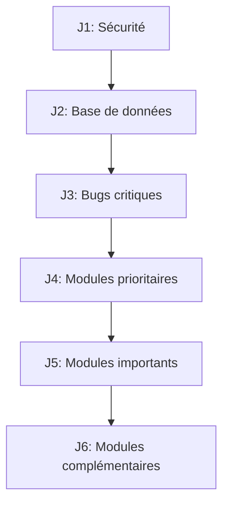

# NYSOA BTP — Plan d'implémentation MVP (6 jours)

## Dépendances

## Jour 1 — Sécurité & Infrastructure (prérequis)

### Tâches
1.1 Proxy Supabase / RLS strictes (C1)
1.2 Auth guard suivi-chantier.html (C4)
1.3 goToAdmin() → checkAuthOrRedirect() (I5)
1.4 QR Code — encoder {id, nom} seulement (I6)

### Fichiers : supabase.js, suivi-chantier.html, script.js

## Jour 2 — Base de données

### Tâches
2.1 CREATE TABLE validations (N1)
2.2 CREATE TABLE devis + devis_lignes (N2)
2.3 ALTER TABLE chantiers ADD devis_id + contrainte unique (N3)
2.4 CREATE TABLE budget_felana (N4)
2.5 CREATE TABLE conges (I3)
2.6 ALTER TABLE personnel ADD chantier_id, compte_actif, statut_validation, type_salaire (N5, I2)
2.7 ALTER TABLE caisse ADD solde_debut, solde_fin (m4)

### Fichier : docs/supabase-schema.sql

## Jour 3 — Bugs critiques

### Tâches
3.1 Renommer id="budget" → budget-global / budget-chantier (C5)
3.2 Pointage manuel → pointage_attendance avec salaire réel (I1)
3.3 Champ type_salaire explicite dans formulaire employé (I2)
3.4 Budgets localStorage → Supabase (C2)
3.5 Stock localStorage → Supabase (C3)

### Fichiers : daf.html, script.js, stock.js, supabase.js

## Jour 4 — Modules prioritaires

### Tâches
4.1 Circuit validations dans admin.html (N1)
4.2 Devis & Proforma dans daf.html (N2)
4.3 Conversion Devis → Chantier (N3)

### Fichiers : admin.html, daf.html, script.js

## Jour 5 — Modules importants

### Tâches
5.1 Comptes Chef scopés (rh.html + login.html) (N5)
5.2 Persister salaires calculés (M4)
5.3 Realtime complet (I7)

### Fichiers : rh.html, login.html, supabase.js

## Jour 6 — Complémentaires

### Tâches
6.1 Budget Felana dans daf.html (N4)
6.2 KPI Bénéfice net admin (N6)
6.3 Centraliser devis dans devis.js (I4)
6.4 PDF fiche de paie → netFinal correct (m2)

### Fichiers : daf.html, admin.html, devis.js, script.js
